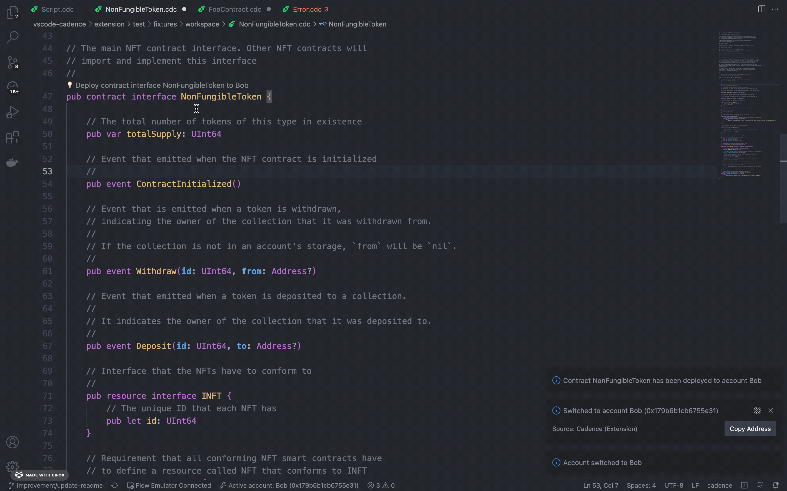

  

  

    <i>Bringing Cadence, the resource-oriented smart contract language of Flow, to your VSCode Editor.</i>
     
  

 

## Installation
#### Install the Cadence extension from the **[Visual Studio Marketplace](https://marketplace.visualstudio.com/items?itemName=onflow.cadence)**
#### The extension is also available on the **[Open VSX Registry](https://open-vsx.org/extension/onflow/cadence)**

Once installed, the extension will help you install other dependencies such as the [Flow CLI](https://docs.onflow.org/flow-cli/install/).

## Features

### Start Emulator
A Flow emulator is hosted for you on the language server once the extension is loaded. You can also switch between accounts and
if your projects contains `flow.json` it gets automatically loaded by the emulator.

#### Self-hosted emulator
You may also choose to run your own Flow emulator locally. The extension will detect your running local emulator and connect to it automatically.

### Deploy Contracts
Deploy contracts to the emulator without leaving the VSCode editor. The address the contract
gets deployed to is returned and available for copying.

### Code Generation
Write cadence code with the speed of light and get your product live before
that afternoon coffee. How? Use the snippets provided by VSCode extension.

But wait, there's much more than meets the eye. VSCode Cadence extension also offers:

- Syntax highlighting (including in Markdown code fences)
- Diagnostics (errors and warnings)
- Code completion, including documentation
- Type information on hover
- Go to declaration
- Go to symbol
- Document outline
- Renaming
- Signature help
- Symbol highlighting
- Code actions
- Declare constants, variables, functions, fields, and methods
- Add missing members when implementing an interface
- Apply removal suggestion
- Apply replacement suggestion
- Run the emulator, submit transactions, scripts from the editor
